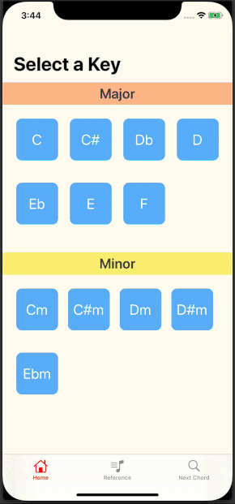

# Next Chord 
An iOS app for musicians to find the next chord to aid in music writing or improvising.

## Description
Next Chord is an iOS app intended for musicians to find the next suggested chord based on the parent chord. Suggested chords is based on common conventional chord progression patterns used in music. More information at https://en.wikipedia.org/wiki/Chord_progression

### Features
* Home Screen - Displays major and minor chords as UICollectionview
* Chord Progression Pattern Screen - Dynamically displays chord progression patterns of key signature as UITableview
* Sound Playback - Sounds of chords can be heard when is tapped in the Chord Progression Pattern Screen
* Reference Screen - List of chords and for key signatures as UITableview
* New Chord Screen - Dynamically show the next chord based on the selected chord as UICollectionsViews

### Basic App Walkthrough

### Run Locally

Project code can be viewed locally and run in Xcode's simulator by cloning or forking this repo.

## Built With
* [Xcode - 11.3.1](https://developer.apple.com/xcode/) - The IDE used
* [Swift - 5.1.4](https://developer.apple.com/swift/) - Programming Language

## Author
* Cao Mai - portfolio can be found at:
https://www.makeschool.com/portfolio/Cao-Mai

## License

This project is licensed under the MIT License - see the [LICENSE.md](LICENSE.md) file for details

## Note
Currently (as of March 2020), the project runs successfully without any error. However, this is a work in progress and not all key signatures/chords are yet added to the project. Most chords don't yet have sounds because they haven't been added. Only keys C major and C minor have chord sounds.

Will try to add more key signatures and chord sounds  when time permits.