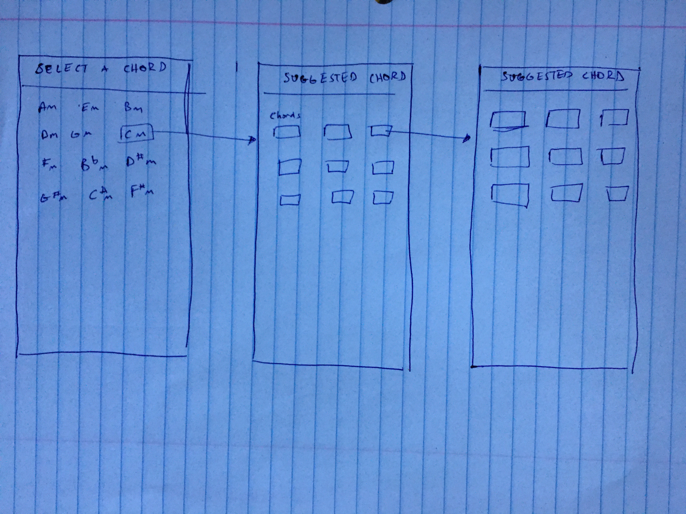

# Juniors Spring Intensive Deliverable Proposal
# Next Chord

Dates 3/16-3/25

**My Name: Cao Mai** 
**Project Name: Next Chord** 
**Is your project New or Old?: New** 
**Is your project Solo or Team?: Solo** 

## Description

Next Chord is an iOS app intended for musicians to find the next suggested chord based on the parent chord. Suggested chords will be based on common conventional chord progressions used in music.

## Challenges I Anticipate

Finding a way to create the app that is user friendly and attractive. Maybe understanding how the chord wheel works to add more custom chord progressions. Adding sounds to the app. Resolving bugs will definitely be a challenge.

## Project "Skateboard" Ideation

Creating a layout of the chords that's compatible across multiple devices.

## Project "Bike" Ideation
Adding sounds or some other user feedback when a chord is tapped.

## Project "Car" Ideation
Animation and making it look professional. Adding a feature where 4 chords are automatically played in a specified tempo.

## Personal Achievement Goals:

**Each teammate must achieve 2 of 3 of their self-set personal achievement goals. If you're not on a team, delete the other teammate sections as needed.**

### Teammate 1

1. Goal 1:
To implement the layout of the project to work with all devices
1. Goal 2:
To add sounds or other form of user feedback once a chord is selected
1. Goal 3:
To make APP look professional

## Wireframes

Subject to change during the development of project. And open to suggestions. 

## Evaluation

**You must meet the following criteria in order to pass the intensive:**

- Students must get proposal approved before starting the project to pass
- SOLO
   - must score an average above a 2.5 on the [rubric]
- TEAM
   - Must score an average above 3 on the [rubric]
   - Each individual completes 2 of the 3 personal achievement goals from their proposal
- Pitch your product

[rubric]:https://docs.google.com/document/d/1IOQDmohLBEBT-hyr-2vgw1mbZUNsq3fHxVfH0oRmVt0/edit

## Approval Checklist
- [x] If I have a team project, I wrote this proposal to represent my work and only my work
- [x] I have completed all the necessary parts of this proposal
- [x] I linked my proposal in the Spring Intensive Tracker

### Sign off

**Student Name: **               
> Cao Mai / March 16 2020  
**Make School Advisor Name: **
> Adriana Gonzalez

